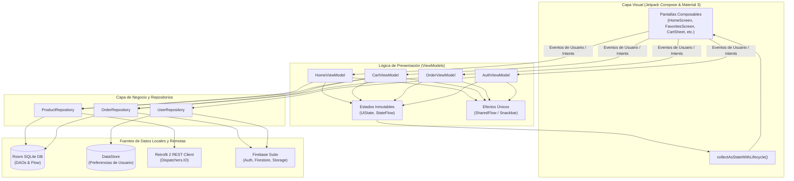
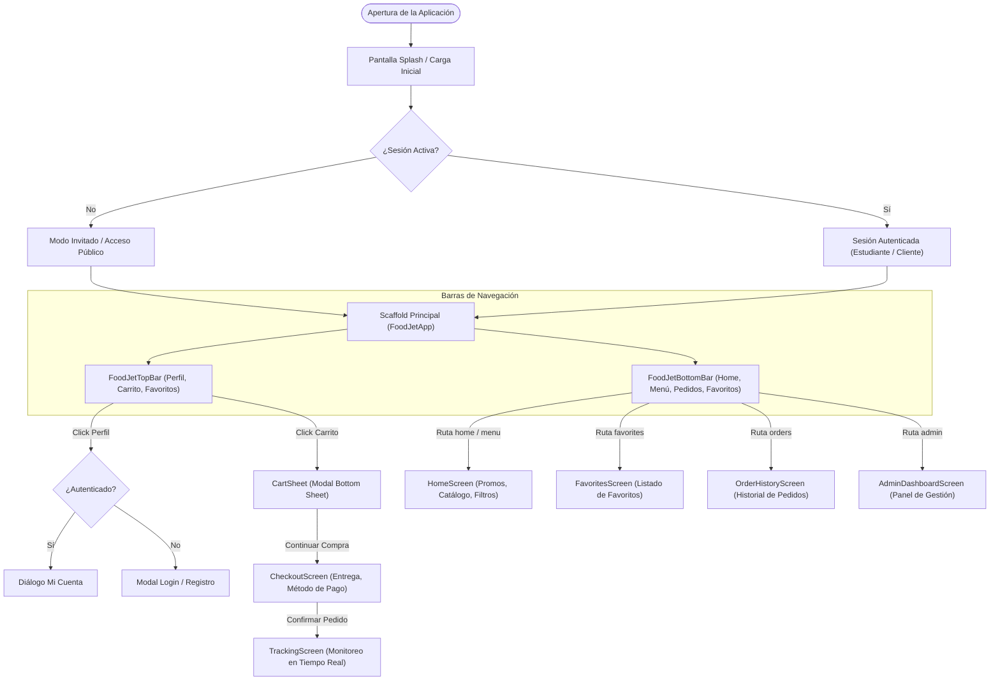
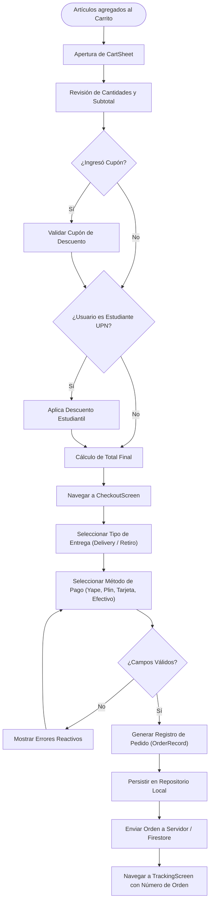
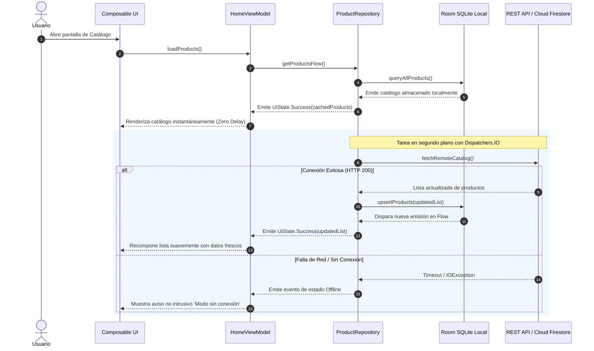
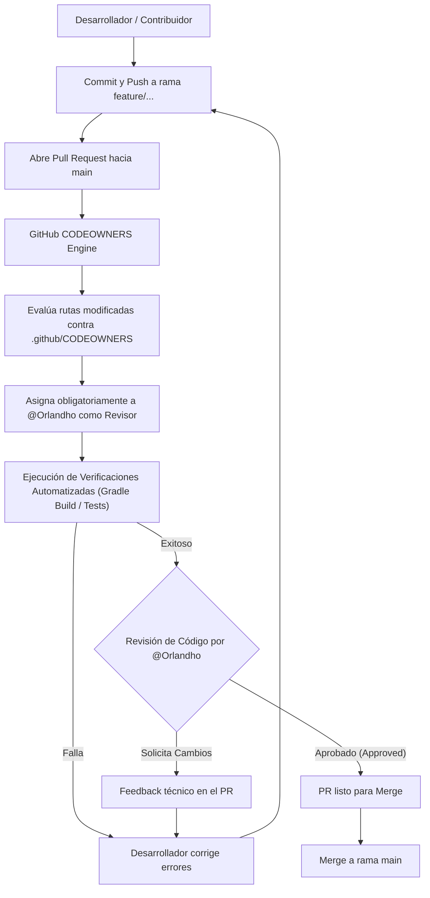
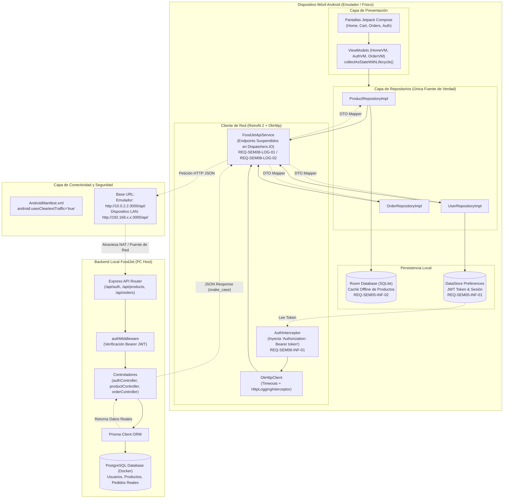

# Arquitectura y Flujos del Sistema - FoodJet App (UPN 2026-2)

Este documento centraliza la arquitectura de software, los flujos de navegación, el ciclo de pedidos y la gobernanza del repositorio regulada por `.github/CODEOWNERS` para el proyecto **FoodJet App**.

Todos los diagramas vectoriales generados en formato SVG de alta resolución se encuentran en el directorio [`mermaid diagramas/`](../mermaid%20diagramas/).

---

## 1. Arquitectura Técnica MVVM y Capas del Sistema
El sistema implementa el patrón arquitectónico **Model-View-ViewModel (MVVM)** desacoplando la capa visual en Jetpack Compose, los ViewModels retenedores de estado ante giros de pantalla, el patrón Repository como única fuente de verdad, y las fuentes de persistencia local (Room, DataStore) y remotas (Retrofit 2, Firebase).

- **Archivo Fuente:** [`mermaid diagramas/01_arquitectura_mvvm_limpia.mmd`](../mermaid%20diagramas/01_arquitectura_mvvm_limpia.mmd)
- **Vector SVG:** [`mermaid diagramas/01_arquitectura_mvvm_limpia.svg`](../mermaid%20diagramas/01_arquitectura_mvvm_limpia.svg)

---

## 2. Flujo de Navegación y Ciclo de Pantallas
Representa el árbol de navegación controlado mediante `Scaffold`, `FoodJetTopBar`, `FoodJetBottomBar` y modales de diálogo.

- **Archivo Fuente:** [`mermaid diagramas/02_flujo_navegacion_pantallas.mmd`](../mermaid%20diagramas/02_flujo_navegacion_pantallas.mmd)
- **Vector SVG:** [`mermaid diagramas/02_flujo_navegacion_pantallas.svg`](../mermaid%20diagramas/02_flujo_navegacion_pantallas.svg)

---

## 3. Flujo de Carrito, Cupones y Checkout
Modela la lógica reactiva de validación de cupones, descuento automático a estudiantes universitarios y confirmación de la orden.

- **Archivo Fuente:** [`mermaid diagramas/03_flujo_checkout_y_pedidos.mmd`](../mermaid%20diagramas/03_flujo_checkout_y_pedidos.mmd)
- **Vector SVG:** [`mermaid diagramas/03_flujo_checkout_y_pedidos.svg`](../mermaid%20diagramas/03_flujo_checkout_y_pedidos.svg)

---

## 4. Estrategia de Persistencia Offline-First
Estrategia para garantizar que la aplicación presente datos locales de inmediato (Zero-Delay) mediante Room SQLite, sincronizando en paralelo con la API REST o Cloud Firestore en hilos secundarios (`Dispatchers.IO`).

- **Archivo Fuente:** [`mermaid diagramas/04_sincronizacion_datos_offline_first.mmd`](../mermaid%20diagramas/04_sincronizacion_datos_offline_first.mmd)
- **Vector SVG:** [`mermaid diagramas/04_sincronizacion_datos_offline_first.svg`](../mermaid%20diagramas/04_sincronizacion_datos_offline_first.svg)

---

## 5. Gobernanza y Flujo de Revisión con CODEOWNERS
Políticas de revisión obligatoria de código asignadas a `@Orlandho` a través del motor `.github/CODEOWNERS`.

- **Archivo Fuente:** [`mermaid diagramas/05_flujo_codeowners_y_pr_review.mmd`](../mermaid%20diagramas/05_flujo_codeowners_y_pr_review.mmd)
- **Vector SVG:** [`mermaid diagramas/05_flujo_codeowners_y_pr_review.svg`](../mermaid%20diagramas/05_flujo_codeowners_y_pr_review.svg)

---

## 6. Arquitectura de Integración con el Backend FoodJet (API REST y PostgreSQL)
El sistema móvil se conecta directamente con los microservicios y base de datos relacional de FoodJet, permitiendo autenticación con JWT Bearer tokens, catálogo en tiempo real con soporte de descuento para estudiantes y ciclo de vida de pedidos. Para la especificación detallada de endpoints, configuración de red local y DTOs, consultar el documento técnico:

👉 **[Guía Técnica de Integración Backend](INTEGRACION_BACKEND_FOODJET.md)**

- **Archivo Fuente:** [`mermaid diagramas/06_integracion_backend_foodjet_api.mmd`](../mermaid%20diagramas/06_integracion_backend_foodjet_api.mmd)
- **Vector SVG:** [`mermaid diagramas/06_integracion_backend_foodjet_api.svg`](../mermaid%20diagramas/06_integracion_backend_foodjet_api.svg)

