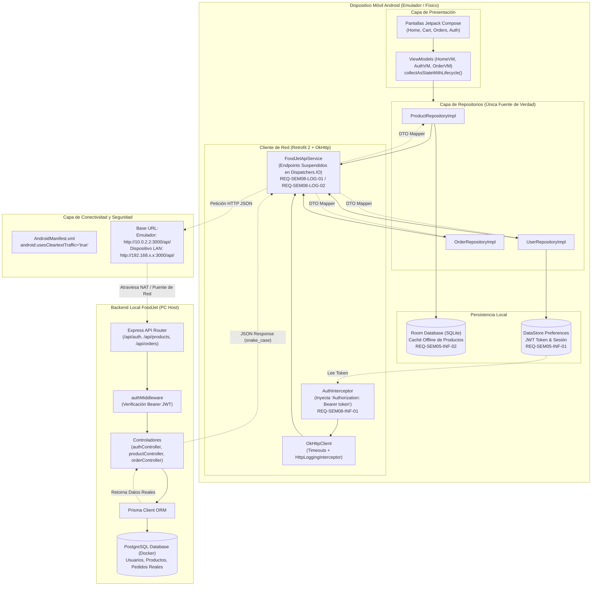

# 🚀 Guía Técnica de Integración: App Móvil FoodJet ↔ Backend Node.js / PostgreSQL

Este documento establece la especificación técnica, arquitectura y plan de acción detallado para conectar la aplicación móvil Android ([`FoodJetApp`](file:///C:/Users/Orlando/Desktop/proyecto%20app%20movil%20UPN%202026-2/app/src/main/java/com/example/foodjeetapp/ui/FoodJetApp.kt)) al backend de **FoodJet** ubicado en [`Pagina-Foodjet/backend`](file:///C:/Users/Orlando/Desktop/Pagina-Foodjet/backend/src/index.js), eliminando todo dato simulado (*mock*) y dejando el sistema listo para producción.

Esta guía se rige de forma estricta por los requerimientos técnicos semanales definidos en el archivo [AGENTS.md](file:///C:/Users/Orlando/Desktop/proyecto%20app%20movil%20UPN%202026-2/AGENTS.md).

---

## 1. Alineación con los Requerimientos de AGENTS.md

La integración con el backend real cubre y satisface los siguientes hitos de la arquitectura:

* **Semana 5 (Persistencia Local y Seguridad):**
  * `REQ-SEM05-INF-01`: Persistencia asíncrona de sesión y token JWT mediante **Jetpack DataStore Preferences**.
  * `REQ-SEM05-INF-02`: Base de datos SQLite relacional con **Room ORM** para catálogo y pedidos en modo *offline-first*.
  * `REQ-SEM05-LOG-02`: Exposición de datos locales hacia la UI mediante flujos reactivos `Flow` de Kotlin.
* **Semana 7 (Contratos REST y Serialización):**
  * `REQ-SEM07-LOG-01`: Especificación de endpoints REST, verbos HTTP, cabeceras de autorización y contratos de datos.
  * `REQ-SEM07-LOG-02`: Definición de DTOs (*Data Transfer Objects*) inmutables y fuertemente tipados.
  * `REQ-SEM07-INF-01`: Configuración de biblioteca de serialización JSON (**Gson** o **Kotlinx Serialization**) con soporte `snake_case` a `camelCase`.
* **Semana 8 (Consumo de APIs REST con Retrofit y Corrutinas):**
  * `REQ-SEM08-LOG-01`: Integración de **Retrofit 2** con cliente HTTP **OkHttp 3**.
  * `REQ-SEM08-LOG-02`: Definición de interfaz `FoodJetApiService` con funciones de suspensión (`suspend`).
  * `REQ-SEM08-LOG-03`: Ejecución de llamadas de red en segundo plano mediante `Dispatchers.IO`.
  * `REQ-SEM08-LOG-04`: Manejo estructurado de códigos HTTP (200 OK, 201 Created, 400 Bad Request, 401 Unauthorized, 403 Forbidden, 404 Not Found, 500 Server Error).
  * `REQ-SEM08-INF-01`: Interceptores de OkHttp para inyección automática de cabecera `Authorization: Bearer <token>`, timeouts y logging.
  * `REQ-SEM08-INF-02`: Estrategia de sincronización y caché local combinando **Room** y **Retrofit**.

---

## 2. Diagrama de Arquitectura de Integración

- **Archivo Fuente Mermaid:** [`mermaid diagramas/06_integracion_backend_foodjet_api.mmd`](../mermaid%20diagramas/06_integracion_backend_foodjet_api.mmd)
- **Vector SVG de Alta Resolución:** [`mermaid diagramas/06_integracion_backend_foodjet_api.svg`](../mermaid%20diagramas/06_integracion_backend_foodjet_api.svg)



---

## 3. Guía de Implementación de los 4 Puntos Clave

### Punto 1: Configuración de Red y Base URL Dinámica (Emulador vs. Celular Físico vs. Producción)

#### El problema técnico:
En Android, la dirección `localhost` o `127.0.0.1` hace referencia al propio emulador/teléfono, no a la computadora física donde corre Node.js y PostgreSQL.

#### Reglas de enrutamiento:
1. **Emulador Oficial de Android Studio:** Debe conectarse a `http://10.0.2.2:3000/api/` (dirección IP de alias del host en el router virtual de Android) o a `http://10.0.2.2:8081/api/` si se accede por el proxy inverso Caddy de Docker.
2. **Dispositivo Físico conectado por Wi-Fi:** Debe usar la IP local asignada a tu PC en la red local (ejemplo: `http://192.168.1.35:3000/api/`).
3. **Dispositivo Físico conectado por cable USB:** Se puede habilitar el reenvío de puertos mediante ADB:
   ```bash
   adb reverse tcp:3000 tcp:3000
   ```
   Con esto, el dispositivo físico sí podrá usar `http://localhost:3000/api/`.
4. **Entorno de Producción Cloud:** Se compila apuntando a la URL HTTPS segura pública (ejemplo: `https://api.foodjet.com/api/`).

#### Implementación recomendada en [`build.gradle.kts`](file:///C:/Users/Orlando/Desktop/proyecto%20app%20movil%20UPN%202026-2/app/build.gradle.kts):
Configurar variables `buildConfigField` para alternar entre desarrollo y producción de forma automática:

```kotlin
android {
    ...
    buildFeatures {
        compose = true
        buildConfig = true
    }

    buildTypes {
        debug {
            // Emulador Android Studio -> PC Host
            buildConfigField("String", "BASE_URL", "\"http://10.0.2.2:3000/api/\"")
        }
        release {
            // Servidor productivo con HTTPS
            buildConfigField("String", "BASE_URL", "\"https://api.foodjet.com/api/\"")
            isMinifyEnabled = true
            proguardFiles(getDefaultProguardFile("proguard-android-optimize.txt"), "proguard-rules.pro")
        }
    }
}
```

---

### Punto 2: Habilitación de Tráfico HTTP sin Cifrar (*Cleartext Traffic*)

#### El problema técnico:
Desde Android 9.0 (API 28), el sistema operativo bloquea por defecto cualquier comunicación de red que viaje por HTTP plano (sin certificado SSL/TLS), arrojando la excepción `java.io.IOException: Cleartext HTTP traffic to 10.0.2.2 not permitted`.

#### Solución Robusta para Desarrollo y Producción:
En lugar de abrir el tráfico no seguro para toda la aplicación en producción, se crea un archivo de configuración de seguridad de red en Android:

1. Crear el archivo `app/src/main/res/xml/network_security_config.xml`:
   ```xml
   <?xml version="1.0" encoding="utf-8"?>
   <network-security-config>
       <!-- Permitir HTTP únicamente para IPs de desarrollo local -->
       <domain-config cleartextTrafficPermitted="true">
           <domain includeSubdomains="true">10.0.2.2</domain>
           <domain includeSubdomains="true">localhost</domain>
           <domain includeSubdomains="true">192.168.1.1</domain>
       </domain-config>
       <!-- Cualquier otro dominio exige HTTPS estricto -->
       <base-config cleartextTrafficPermitted="false" />
   </network-security-config>
   ```

2. Vincularlo en [`AndroidManifest.xml`](file:///C:/Users/Orlando/Desktop/proyecto%20app%20movil%20UPN%202026-2/app/src/main/AndroidManifest.xml):
   ```xml
   <application
       android:allowBackup="true"
       android:networkSecurityConfig="@xml/network_security_config"
       android:usesCleartextTraffic="true"
       ...>
   ```

---

### Punto 3: Dependencias Gradle y Mapeo de DTOs (`snake_case` a `camelCase`)

#### El problema técnico:
El backend en PostgreSQL y Prisma ([`schema.prisma`](file:///C:/Users/Orlando/Desktop/Pagina-Foodjet/backend/prisma/schema.prisma)) utiliza convención `snake_case` para sus columnas y respuestas JSON:
- `restaurante_id`, `tipo_comida`, `imagen_url`, `descuento_estudiante`, `tiempo_entrega`.

En cambio, la aplicación móvil Kotlin ([`FoodJetModels.kt`](file:///C:/Users/Orlando/Desktop/proyecto%20app%20movil%20UPN%202026-2/app/src/main/java/com/example/foodjeetapp/data/model/FoodJetModels.kt)) utiliza convención `camelCase`:
- `restauranteId`, `tipoComida`, `imagenUrl`, `descuentoEstudiante`, `tiempoEntrega`.

#### 1. Dependencias a declarar en [`gradle/libs.versions.toml`](file:///C:/Users/Orlando/Desktop/proyecto%20app%20movil%20UPN%202026-2/gradle/libs.versions.toml):
```toml
[versions]
retrofit = "2.11.0"
okhttp = "4.12.0"
room = "2.6.1"
datastore = "1.1.1"

[libraries]
retrofit-core = { group = "com.squareup.retrofit2", name = "retrofit", version.ref = "retrofit" }
retrofit-converter-gson = { group = "com.squareup.retrofit2", name = "converter-gson", version.ref = "retrofit" }
okhttp-logging = { group = "com.squareup.okhttp3", name = "logging-interceptor", version.ref = "okhttp" }
androidx-datastore-preferences = { group = "androidx.datastore", name = "datastore-preferences", version.ref = "datastore" }
androidx-room-runtime = { group = "androidx.room", name = "room-runtime", version.ref = "room" }
androidx-room-ktx = { group = "androidx.room", name = "room-ktx", version.ref = "room" }
```

#### 2. Definición de DTOs en `data/remote/dto/`:

```kotlin
package com.example.foodjeetapp.data.remote.dto

import com.google.gson.annotations.SerializedName
import com.example.foodjeetapp.data.model.ProductItem

data class RestaurantDto(
    @SerializedName("nombre") val nombre: String?,
    @SerializedName("tiempo_entrega") val tiempoEntrega: String?,
    @SerializedName("calificacion_promedio") val calificacionPromedio: Double?,
    @SerializedName("qr_pago") val qrPago: String?
)

data class ProductDto(
    @SerializedName("id") val id: Int,
    @SerializedName("restaurante_id") val restauranteId: Int,
    @SerializedName("nombre") val nombre: String,
    @SerializedName("descripcion") val descripcion: String?,
    @SerializedName("precio") val precio: Double,
    @SerializedName("tipo_comida") val tipoComida: String?,
    @SerializedName("imagen_url") val imagenUrl: String?,
    @SerializedName("descuento_estudiante") val descuentoEstudiante: Double?,
    @SerializedName("disponibilidad") val disponibilidad: Boolean?,
    @SerializedName("Restaurant") val restaurant: RestaurantDto?
) {
    fun toDomain(): ProductItem {
        return ProductItem(
            id = id,
            nombre = nombre,
            descripcion = descripcion ?: "",
            precio = precio,
            tipoComida = tipoComida ?: "General",
            imagenUrl = imagenUrl ?: "",
            descuentoEstudiante = descuentoEstudiante ?: 0.0,
            disponibilidad = disponibilidad ?: true,
            tiempoEntrega = restaurant?.tiempoEntrega ?: "30 minutos",
            restauranteNombre = restaurant?.nombre ?: "FoodJet Express",
            restauranteId = restauranteId
        )
    }
}
```

---

### Punto 4: Sustitución de Mocks por Repositorios Reales

Se deben sustituir los retornos vacíos y simulados de [`ProductRepositoryImpl`](file:///C:/Users/Orlando/Desktop/proyecto%20app%20movil%20UPN%202026-2/app/src/main/java/com/example/foodjeetapp/data/repository/ProductRepository.kt), [`UserRepositoryImpl`](file:///C:/Users/Orlando/Desktop/proyecto%20app%20movil%20UPN%202026-2/app/src/main/java/com/example/foodjeetapp/data/repository/UserRepository.kt) y [`OrderRepositoryImpl`](file:///C:/Users/Orlando/Desktop/proyecto%20app%20movil%20UPN%202026-2/app/src/main/java/com/example/foodjeetapp/data/repository/OrderRepository.kt).

#### 1. Interfaz del Servicio Retrofit (`FoodJetApiService.kt`):
```kotlin
package com.example.foodjeetapp.data.remote

import com.example.foodjeetapp.data.remote.dto.*
import retrofit2.Response
import retrofit2.http.*

interface FoodJetApiService {
    // Autenticación
    @POST("auth/login")
    suspend fun login(@Body body: LoginRequestDto): Response<LoginResponseDto>

    @POST("auth/register")
    suspend fun register(@Body body: RegisterRequestDto): Response<RegisterResponseDto>

    @GET("auth/me")
    suspend fun getProfile(): Response<UserProfileResponseDto>

    // Catálogo de Productos
    @GET("products")
    suspend fun getProducts(): Response<List<ProductDto>>

    // Pedidos
    @GET("orders/my-orders")
    suspend fun getMyOrders(): Response<List<OrderResponseDto>>

    @POST("orders")
    suspend fun createOrder(@Body body: CreateOrderRequestDto): Response<CreateOrderResponseDto>
}
```

#### 2. Interceptor de Autorización OkHttp (`AuthInterceptor.kt`):
Inyecta el token Bearer JWT recuperado de `DataStore` en cada petición saliente hacia endpoints protegidos:
```kotlin
package com.example.foodjeetapp.data.remote

import com.example.foodjeetapp.data.local.SessionDataStore
import kotlinx.coroutines.flow.firstOrNull
import kotlinx.coroutines.runBlocking
import okhttp3.Interceptor
import okhttp3.Response

class AuthInterceptor(private val sessionDataStore: SessionDataStore) : Interceptor {
    override fun intercept(chain: Interceptor.Chain): Response {
        val original = chain.request()
        val token = runBlocking { sessionDataStore.tokenFlow.firstOrNull() }

        val requestBuilder = original.newBuilder()
        if (!token.isNullOrBlank()) {
            requestBuilder.header("Authorization", "Bearer $token")
        }
        return chain.proceed(requestBuilder.build())
    }
}
```

#### 3. Implementación Productiva de [`ProductRepositoryImpl.kt`](file:///C:/Users/Orlando/Desktop/proyecto%20app%20movil%20UPN%202026-2/app/src/main/java/com/example/foodjeetapp/data/repository/ProductRepository.kt):
Implementa el patrón *offline-first*: consulta la caché local en SQLite (Room), realiza la petición al backend en segundo plano con `Dispatchers.IO`, actualiza la base de datos local y emite los cambios de forma reactiva:

```kotlin
class ProductRepositoryImpl(
    private val api: FoodJetApiService,
    private val productDao: ProductDao,
    private val ioDispatcher: CoroutineDispatcher = Dispatchers.IO
) : ProductRepository {

    override fun getProductsStream(): Flow<List<ProductItem>> {
        return productDao.getAllProductsFlow().map { entities ->
            entities.map { it.toDomain() }
        }
    }

    override suspend fun getProducts(): Result<List<ProductItem>> = withContext(ioDispatcher) {
        try {
            val response = api.getProducts()
            if (response.isSuccessful && response.body() != null) {
                val dtos = response.body()!!
                productDao.insertAll(dtos.map { it.toEntity() })
                Result.success(dtos.map { it.toDomain() })
            } else {
                Result.failure(Exception("Error al cargar productos: ${response.code()} ${response.message()}"))
            }
        } catch (e: Exception) {
            // En caso de falla de red, se retornan los datos cacheados en Room
            val cached = productDao.getAllProducts()
            if (cached.isNotEmpty()) {
                Result.success(cached.map { it.toDomain() })
            } else {
                Result.failure(e)
            }
        }
    }
}
```

#### 4. Implementación Productiva de [`UserRepositoryImpl.kt`](file:///C:/Users/Orlando/Desktop/proyecto%20app%20movil%20UPN%202026-2/app/src/main/java/com/example/foodjeetapp/data/repository/UserRepository.kt):
```kotlin
class UserRepositoryImpl(
    private val api: FoodJetApiService,
    private val sessionDataStore: SessionDataStore,
    private val ioDispatcher: CoroutineDispatcher = Dispatchers.IO
) : UserRepository {

    override suspend fun login(email: String, password: String): Result<UserProfile> = withContext(ioDispatcher) {
        try {
            val response = api.login(LoginRequestDto(email = email, password = password))
            if (response.isSuccessful && response.body() != null) {
                val data = response.body()!!
                // Guardar token JWT y sesión en DataStore (REQ-SEM05-INF-01)
                sessionDataStore.saveSession(
                    token = data.token,
                    userId = data.user.id,
                    email = data.user.email,
                    isStudent = data.user.esEstudiante
                )
                Result.success(data.user.toDomain())
            } else {
                Result.failure(Exception("Credenciales incorrectas."))
            }
        } catch (e: Exception) {
            Result.failure(e)
        }
    }
}
```

---

## 4. Verificación y Pruebas en Vivo con el Backend Local

Para probar la integración de extremo a extremo sin datos simulados:

1. **Iniciar el Backend de FoodJet:**
   * Abre una terminal en `Pagina-Foodjet` y ejecuta:
     ```bash
     docker compose up -d
     ```
   * O ejecuta directamente el servidor Node.js en `Pagina-Foodjet/backend`:
     ```bash
     npm run dev
     ```
   * Verifica que la consola indique: `🚀 Servidor ejecutándose en http://localhost:3000`.

2. **Cuentas Reales de Prueba (Sembradas en PostgreSQL):**
   * **Cliente Estudiante:** `cliente1@mail.com` / `Cliente123!` (verificará descuento en productos).
   * **Cliente Estándar:** `cliente2@mail.com` / `Cliente123!`.
   * **Administrador:** `admin@foodjet.com` / `Admin123!`.

3. **Verificación en Android Studio:**
   * Ejecuta la app en el emulador virtual.
   * Abre la pestaña **Logcat** y filtra por `OkHttp` para observar en vivo el envío de cabeceras `Authorization: Bearer ...` y las respuestas HTTP `200 OK` con datos reales de la base de datos PostgreSQL.
