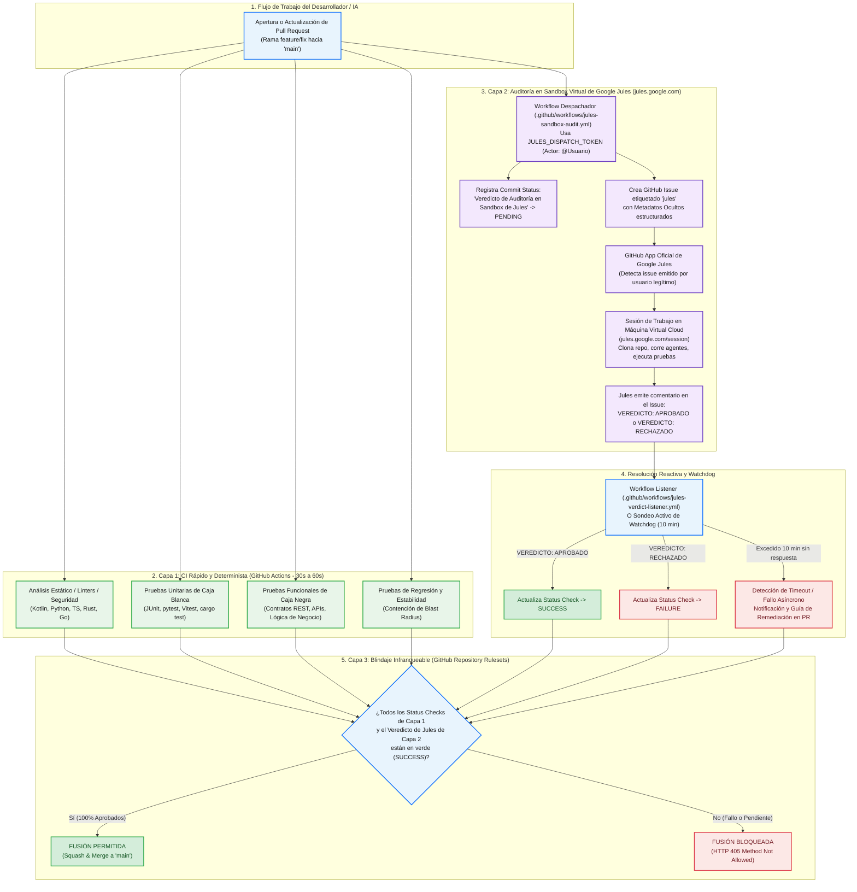

# 📘 Guía Maestra: Arquitectura Híbrida de Pruebas Automatizadas y Auditoría en Sandbox Virtual de Google Jules
**Estándar de Oro para Ingeniería de Software y Agentes Autónomos de Inteligencia Artificial**

---

## 📑 Tabla de Contenidos
1. [Manifiesto y Fundamentos: El Estándar de Oro vs. Antipatrones Comunes](#1-manifiesto-y-fundamentos-el-estándar-de-oro-vs-antipatrones-comunes)
2. [Diagrama de Arquitectura Universal de Replicación](#2-diagrama-de-arquitectura-universal-de-replicación)
3. [El Misterio del Bot Token: Regla Anti-Recursión y `JULES_DISPATCH_TOKEN`](#3-el-misterio-del-bot-token-regla-anti-recursión-y-jules_dispatch_token)
4. [Matriz de Adaptación Multi-Lenguaje para Capa 1 (CI Determinista)](#4-matriz-de-adaptación-multi-lenguaje-para-capa-1-ci-determinista)
5. [Plantillas Universales de Capa 2 (Workflows y Scripts del Sandbox de Jules)](#5-plantillas-universales-de-capa-2-workflows-y-scripts-del-sandbox-de-jules)
6. [Blindaje de Rama Principal mediante GitHub Repository Rulesets (Capa 3)](#6-blindaje-de-rama-principal-mediante-github-repository-rulesets-capa-3)
7. [Manual de Remediación Rápida ante Incidencias Asíncronas](#7-manual-de-remediación-rápida-ante-incidencias-asíncronas)
8. [Checklist Acelerado de Replicación en 5 Minutos](#8-checklist-acelerado-de-replicación-en-5-minutos)

---

## 1. Manifiesto y Fundamentos: El Estándar de Oro vs. Antipatrones Comunes

Cuando los equipos de desarrollo intentan integrar pruebas con Inteligencia Artificial o el agente autónomo Google Jules (`jules.google.com`), frecuentemente caen en **antipatrones graves** que proporcionan una falsa sensación de seguridad o rompen la automatización.

### 📊 Tabla Comparativa de Arquitectura

| Dimensión | ❌ Antipatrón 1 (Simulación) | ❌ Antipatrón 2 (LLM Raw en CI) | 🌟 El Estándar de Oro (Esta Arquitectura) |
| :--- | :--- | :--- | :--- |
| **Naturaleza de Pruebas** | Scripts ciegos con `exit 0` o aserciones simuladas. | Llamada HTTP a la API de Gemini/OpenAI desde el runner. | **100% reales en runners nativos** (JUnit, pytest, Vitest) con reportes deterministas. |
| **Entorno de Jules** | No existe entorno; puro texto falso. | No existe sesión en la nube; gasta tokens de API REST cruda. | **Máquina virtual aislada en Google Jules** (`jules.google.com/session`) con clonado del repo. |
| **Interacción Humana** | Ninguna visibilidad. | Texto en logs de GitHub Actions. | **Sesión visual interactiva** en el panel web de Google Jules con seguimiento de agentes. |
| **Status Checks** | Checks verdes artificiales. | No vinculante o frágil ante timeouts de API. | **Status Check vinculante** (`PENDING` -> `SUCCESS`/`FAILURE`) respaldado por Rulesets. |
| **Tolerancia a Fallos** | Nula (ignora errores). | Se cuelga el runner de Actions. | **Watchdog de 10 min** con logging diagnóstico y guía de remediación en el PR. |

### 🛑 Regla Anti-Simulaciones
> **Prohibición Terminante:** Ningún repositorio bajo este estándar admitirá pruebas simuladas, mocks pasivos que no verifiquen lógica de negocio o aserciones triviales. El CI debe romper ante regresiones reales, y Jules debe auditar el diferencial en su contenedor virtual antes de que se autorice cualquier fusión.

---

## 2. Diagrama de Arquitectura Universal de Replicación

- **Archivo Fuente Mermaid:** [`diagrama_arquitectura_universal_jules.mmd`](diagrama_arquitectura_universal_jules.mmd)
- **Vector SVG de Alta Resolución:** [`diagrama_arquitectura_universal_jules.svg`](diagrama_arquitectura_universal_jules.svg)



---

## 3. El Misterio del Bot Token: Regla Anti-Recursión y `JULES_DISPATCH_TOKEN`

Uno de los descubrimientos de ingeniería más críticos para que este sistema funcione es la **Regla de Filtrado Anti-Recursión de GitHub Apps**:

### 🔍 ¿Por qué Google Jules no respondía a los Issues creados por GitHub Actions?
1. Por defecto, los flujos de GitHub Actions se autentican utilizando `secrets.GITHUB_TOKEN`.
2. Cuando la acción crea un Issue o agrega la etiqueta `jules`, GitHub registra el evento con el actor **`github-actions[bot]`**.
3. **El filtro de seguridad:** Para evitar tormentas de bucles infinitos (`bot crea issue -> app responde -> bot crea issue`), la GitHub App oficial de Google Jules (`@google-labs-jules[bot]`) **descarta silenciosamente todos los webhooks disparados por otros bots**.
4. Por esta razón, el Issue se creaba en el repositorio, pero Jules jamás abría una sesión en `jules.google.com/session`.

### 💡 La Solución Definitiva: `JULES_DISPATCH_TOKEN`
Para que Jules responda de forma instantánea (en ~2 segundos), el Issue debe ser despachado en nombre de un **usuario humano legítimo**:
1. Genera un **Personal Access Token (PAT)** de GitHub (Classic o Fine-Grained) con permisos de:
   - `repo` (Acceso completo a repositorios privados/públicos).
   - `issues:write` (Creación y etiquetado de issues).
   - `statuses:write` (Actualización de commit status checks).
2. Regístralo en los secretos del repositorio (**Settings -> Secrets and variables -> Actions**) con el nombre:
   ```text
   JULES_DISPATCH_TOKEN
   ```
3. En el workflow despachador, consume el token con este patrón de respaldo infalible:
   ```yaml
   env:
     GITHUB_TOKEN: ${{ secrets.JULES_DISPATCH_TOKEN || secrets.GITHUB_TOKEN }}
   ```
Al despachar con este token, el autor del Issue es `@TuUsuario`, el webhook de la GitHub App se valida como legítimo y Jules abre la sesión en la nube en 2 segundos.

---

## 4. Matriz de Adaptación Multi-Lenguaje para Capa 1 (CI Determinista)

La Capa 1 ejecuta las pruebas rápidas y deterministas en los runners de GitHub Actions (30 a 60 segundos). A continuación se detallan las 4 suites por tecnología:

| Tecnología | 1. Análisis Estático / Seguridad | 2. Unitarias (Caja Blanca) | 3. Funcionales (Caja Negra) | 4. Regresión |
| :--- | :--- | :--- | :--- | :--- |
| **Android / Kotlin** | `./gradlew compileDebugKotlin` + OWASP | `./gradlew testDebugUnitTest` | Contratos Retrofit y cálculo de IGV/precios | Modelos Room / Blast Radius |
| **Python** | `ruff check .` / `flake8` | `pytest tests/unit/ -v` | `pytest tests/functional/ -v` | `pytest tests/regression/ -v` |
| **Node.js / TS** | `npm run lint` / `tsc --noEmit` | `npm run test:unit` | `npm run test:e2e` / Supertest | Validaciones de esquema DTO |
| **Rust** | `cargo clippy -- -D warnings` | `cargo test --lib` | `cargo test --test functional` | `cargo test --test regression` |
| **Go** | `golangci-lint run` | `go test -v ./pkg/...` | `go test -v ./tests/functional/...` | `go test -v ./tests/regression/...` |

---

## 5. Plantillas Universales de Capa 2 (Workflows y Scripts del Sandbox de Jules)

Para replicar la integración en cualquier repositorio, solo se requiere incorporar 2 workflows y 2 scripts en la carpeta `.github/`:

### 📁 5.1. Workflow Despachador: `.github/workflows/jules-sandbox-audit.yml`

```yaml
name: "Jules - Auditoría en Sandbox Virtual y Veredicto"

on:
  pull_request:
    branches: [ main, master ]
    types: [ opened, synchronize, reopened, labeled ]
  workflow_dispatch:
    inputs:
      pr_number:
        description: "Número del Pull Request a auditar"
        required: false

permissions:
  contents: read
  pull-requests: write
  issues: write
  statuses: write

jobs:
  auditar-sandbox-jules:
    name: Veredicto de Auditoría en Sandbox de Jules
    runs-on: ubuntu-latest

    # Evita ejecuciones innecesarias en eventos labeled no relevantes
    if: >
      github.event_name != 'pull_request' ||
      github.event.action != 'labeled' ||
      (github.event.label.name == 'reintentar-jules' || github.event.label.name == 'jules-audit')

    steps:
      - name: Descargar repositorio
        uses: actions/checkout@v4

      - name: Configurar Node.js
        uses: actions/setup-node@v4
        with:
          node-version: '20'

      - name: Despachar Sesión a Google Jules y Ejecutar Watchdog de Veredicto
        env:
          GITHUB_TOKEN: ${{ secrets.JULES_DISPATCH_TOKEN || secrets.GITHUB_TOKEN }}
          GITHUB_REPOSITORY: ${{ github.repository }}
          GITHUB_API_URL: ${{ github.api_url }}
          WATCHDOG_TIMEOUT_MINUTES: 10
          POLL_INTERVAL_SECONDS: 25
        run: |
          node .github/scripts/jules-sandbox-dispatcher.js
```

---

### 📁 5.2. Script Despachador con Metadatos y Watchdog: `.github/scripts/jules-sandbox-dispatcher.js`

El despachador implementa 4 funciones esenciales:
1. Pone el status check `Veredicto de Auditoría en Sandbox de Jules` en estado `PENDING`.
2. Inyecta comentarios HTML invisibles con metadatos estructurados (`<!-- JULES_AUDIT_METADATA ... -->`).
3. Crea el Issue con etiquetas `jules` y `audit-sandbox`.
4. Ejecuta un bucle watchdog de sondeo durante 10 minutos para detectar `VEREDICTO: APROBADO` o `VEREDICTO: RECHAZADO` tanto en el commit status como en los comentarios del Issue. Si expira el plazo, marca `FAILURE` y publica la guía de remediación en el PR.

```javascript
/**
 * jules-sandbox-dispatcher.js
 * Despachador agéntico con metadatos estructurados y watchdog resiliente.
 */
const fs = require('fs');

const GITHUB_TOKEN = process.env.GITHUB_TOKEN || process.env.GITHUB_PERSONAL_ACCESS_TOKEN;
const GITHUB_REPOSITORY = process.env.GITHUB_REPOSITORY;
const GITHUB_API_URL = process.env.GITHUB_API_URL || 'https://api.github.com';
const STATUS_CONTEXT = 'Veredicto de Auditoría en Sandbox de Jules';
const WATCHDOG_TIMEOUT_MINUTES = parseInt(process.env.WATCHDOG_TIMEOUT_MINUTES || '10', 10);
const POLL_INTERVAL_SECONDS = parseInt(process.env.POLL_INTERVAL_SECONDS || '25', 10);

async function ghRequest(endpoint, method = 'GET', body = null) {
  const res = await fetch(`${GITHUB_API_URL}${endpoint}`, {
    method,
    headers: {
      'Authorization': `Bearer ${GITHUB_TOKEN}`,
      'Accept': 'application/vnd.github+json',
      'User-Agent': 'Jules-Dispatcher/1.0',
      'Content-Type': 'application/json'
    },
    body: body ? JSON.stringify(body) : null
  });
  if (!res.ok) throw new Error(`GitHub API error: HTTP ${res.status}`);
  return await res.json();
}

async function setCommitStatus(sha, state, description, targetUrl = null) {
  const payload = { state, description: description.substring(0, 140), context: STATUS_CONTEXT };
  if (targetUrl) payload.target_url = targetUrl;
  return await ghRequest(`/repos/${GITHUB_REPOSITORY}/statuses/${sha}`, 'POST', payload);
}

async function main() {
  const event = JSON.parse(fs.readFileSync(process.env.GITHUB_EVENT_PATH, 'utf8'));
  const pr = event.pull_request;
  if (!pr) process.exit(0);

  const prNumber = pr.number;
  const headSha = pr.head.sha;
  const headRef = pr.head.ref;
  const baseRef = pr.base.ref;

  // 1. Marcar check en PENDING
  await setCommitStatus(headSha, 'pending', 'Esperando veredicto del Agente Jules en sandbox virtual...');

  // 2. Metadatos estructurados ocultos
  const issueBody = `<!-- JULES_AUDIT_METADATA
PR_NUMBER: ${prNumber}
COMMIT_SHA: ${headSha}
BRANCH: ${headRef}
BASE: ${baseRef}
-->
# 🤖 [Google Jules] Misión de Auditoría en Entorno Virtual para PR #${prNumber}

Por favor clona la rama \`${headRef}\`, corre la suite de pruebas del proyecto y emite tu veredicto final:
\`VEREDICTO: APROBADO\` o \`VEREDICTO: RECHAZADO\`.
`;

  // 3. Crear Issue con etiqueta jules
  const issue = await ghRequest(`/repos/${GITHUB_REPOSITORY}/issues`, 'POST', {
    title: `[jules] Auditoría de Calidad y Sandbox para PR #${prNumber}: ${pr.title}`,
    body: issueBody,
    labels: ['jules', 'audit-sandbox']
  });

  await setCommitStatus(headSha, 'pending', `Sesión Jules despachada (#${issue.number}). Esperando veredicto...`, issue.html_url);

  // 4. Watchdog de 10 minutos
  const startTime = Date.now();
  const maxWait = WATCHDOG_TIMEOUT_MINUTES * 60 * 1000;
  let finalState = 'pending';

  while (Date.now() - startTime < maxWait) {
    await new Promise(r => setTimeout(r, POLL_INTERVAL_SECONDS * 1000));
    
    // Inspección directa de comentarios en el Issue creado
    const comments = await ghRequest(`/repos/${GITHUB_REPOSITORY}/issues/${issue.number}/comments`);
    for (const c of (comments || [])) {
      if (/VEREDICTO:\s*APROBADO/i.test(c.body)) {
        await setCommitStatus(headSha, 'success', '✅ Aprobado por el Agente Jules en entorno virtual', c.html_url);
        finalState = 'success';
        break;
      } else if (/VEREDICTO:\s*RECHAZADO/i.test(c.body)) {
        await setCommitStatus(headSha, 'failure', '❌ Rechazado por el Agente Jules', c.html_url);
        finalState = 'failure';
        break;
      }
    }
    if (finalState !== 'pending') break;
  }

  if (finalState === 'pending') {
    await setCommitStatus(headSha, 'failure', 'Timeout en Sandbox de Jules (10m). Ver guía en PR.');
    process.exit(1);
  }
}
main();
```

---

### 📁 5.3. Workflow Listener: `.github/workflows/jules-verdict-listener.yml`

```yaml
name: "Jules - Listener de Veredictos del Sandbox"

on:
  issue_comment:
    types: [ created ]

permissions:
  contents: read
  pull-requests: write
  issues: write
  statuses: write

jobs:
  procesar-veredicto:
    runs-on: ubuntu-latest
    if: >
      contains(github.event.issue.labels.*.name, 'jules') ||
      startsWith(github.event.issue.title, '[jules]')
    steps:
      - uses: actions/checkout@v4
      - uses: actions/setup-node@v4
        with:
          node-version: '20'
      - env:
          GITHUB_TOKEN: ${{ secrets.JULES_DISPATCH_TOKEN || secrets.GITHUB_TOKEN }}
          GITHUB_REPOSITORY: ${{ github.repository }}
        run: node .github/scripts/jules-verdict-processor.js
```

---

## 6. Blindaje de Rama Principal mediante GitHub Repository Rulesets (Capa 3)

Para garantizar que sea matemáticamente imposible fusionar código sin la aprobación de Jules y de las pruebas deterministas, se debe configurar un **GitHub Repository Ruleset**:

### 🛡️ Configuración Paso a Paso en GitHub
1. Ve a **Settings -> Rules -> Rulesets -> New ruleset -> New branch ruleset**.
2. **General:**
   - Name: `main-protection`
   - Enforcement status: **Active**.
3. **Target branches:**
   - Include default branch (`~DEFAULT_BRANCH`).
4. **Branch rules:**
   - Marcar: **Restrict deletions**.
   - Marcar: **Block force pushes**.
   - Marcar: **Require a pull request before merging** (Allowed merge methods: *Squash*).
   - Marcar: **Require status checks to pass**:
     - Política estricta activada: **Require branches to be up to date before merging**.
     - Agregar los 5 checks requeridos:
       * `Análisis Estático`
       * `Pruebas Unitarias`
       * `Pruebas Funcionales`
       * `Pruebas de Regresión`
       * `Veredicto de Auditoría en Sandbox de Jules`

### 💻 Automatización con GitHub REST API (`PUT /rulesets`)
```json
{
  "name": "Main",
  "target": "branch",
  "enforcement": "active",
  "conditions": { "ref_name": { "exclude": [], "include": ["~DEFAULT_BRANCH"] } },
  "rules": [
    { "type": "deletion" },
    { "type": "non_fast_forward" },
    {
      "type": "pull_request",
      "parameters": {
        "required_approving_review_count": 0,
        "allowed_merge_methods": ["squash"]
      }
    },
    {
      "type": "required_status_checks",
      "parameters": {
        "strict_required_status_checks_policy": true,
        "do_not_enforce_on_create": false,
        "required_status_checks": [
          { "context": "test" },
          { "context": "Veredicto de Auditoría en Sandbox de Jules" }
        ]
      }
    }
  ]
}
```

---

## 7. Manual de Remediación Rápida ante Incidencias Asíncronas

Si el watchdog marca `FAILURE` o un Pull Request se queda bloqueado, utiliza este árbol de decisión rápido:

```text
¿El PR está bloqueado?
 ├── ¿Falló una prueba de Capa 1 (Gradle / pytest / Vitest)?
 │    └── Solución: Corrige el error en tu código local y haz git push.
 └── ¿El status check 'Veredicto de Auditoría en Sandbox de Jules' está en FAILURE o PENDING?
      ├── Caso A: ¿El Issue se creó con autor 'github-actions[bot]'?
      │    └── Solución: Configura el secreto JULES_DISPATCH_TOKEN con un PAT legítimo.
      ├── Caso B: ¿El repositorio no aparece en jules.google.com?
      │    └── Solución: Entra a jules.google.com -> 'Configure repo' -> marca el repositorio.
      ├── Caso C: ¿Ocurrió un Timeout de 10 minutos?
      │    └── Solución: Agrega la etiqueta 'reintentar-jules' al PR para relanzar la sesión.
      └── Caso D: ¿Se agotó la cuota diaria (Daily session limit 100/100)?
           └── Solución: Espera el reinicio de la cuota diaria a las 00:00 UTC.
```

---

## 8. Checklist Acelerado de Replicación en 5 Minutos

Sigue esta lista de comprobación secuencial para habilitar cualquier nuevo repositorio:

- [ ] **Paso 1:** Ingresar a [jules.google.com/session](https://jules.google.com/session) -> Menú superior derecho **"Configure repo"** (engranaje) -> Autorizar el repositorio.
- [ ] **Paso 2:** Generar un PAT personal de GitHub con permisos de `repo`, `issues:write` y `statuses:write`.
- [ ] **Paso 3:** Guardar el token en el repositorio como secret: `JULES_DISPATCH_TOKEN`.
- [ ] **Paso 4:** Copiar los scripts a `.github/scripts/`:
  - `jules-sandbox-dispatcher.js`
  - `jules-verdict-processor.js`
- [ ] **Paso 5:** Copiar los workflows a `.github/workflows/`:
  - `jules-sandbox-audit.yml`
  - `jules-verdict-listener.yml`
- [ ] **Paso 6:** Configurar el **GitHub Ruleset** en la rama `main` exigiendo los status checks deterministas y `Veredicto de Auditoría en Sandbox de Jules`.
- [ ] **Paso 7:** Crear una rama `feat/test-jules-ci`, abrir un Pull Request y presenciar cómo Jules levanta su sesión en la nube y desbloquea el merge al aprobar.
